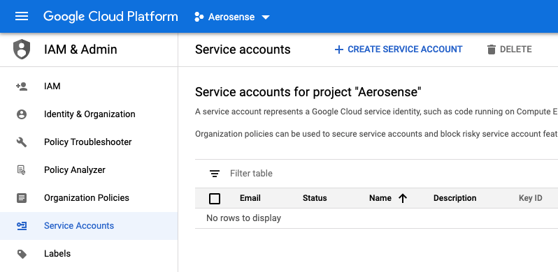
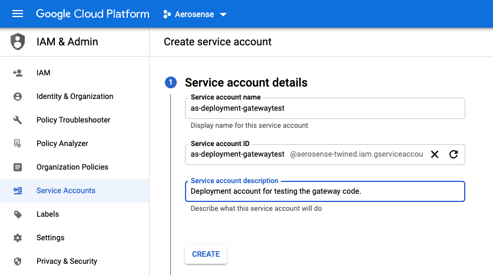
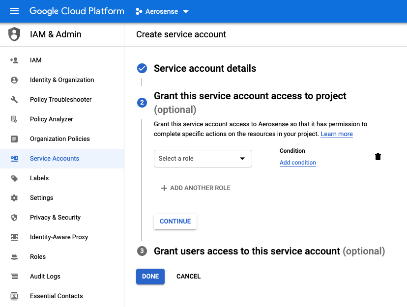
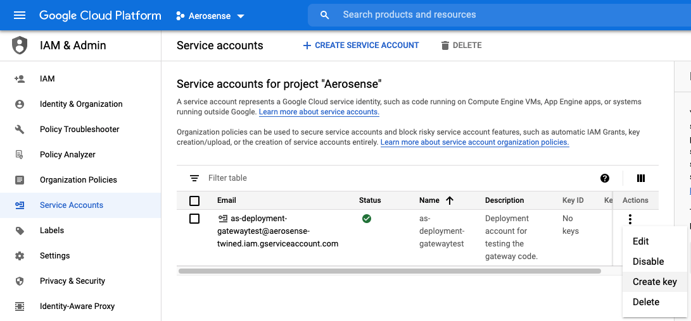
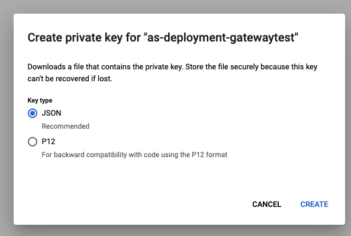
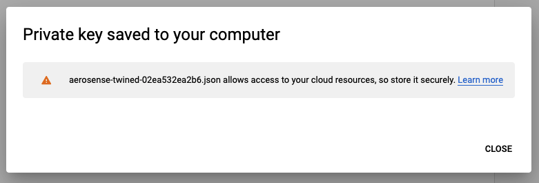
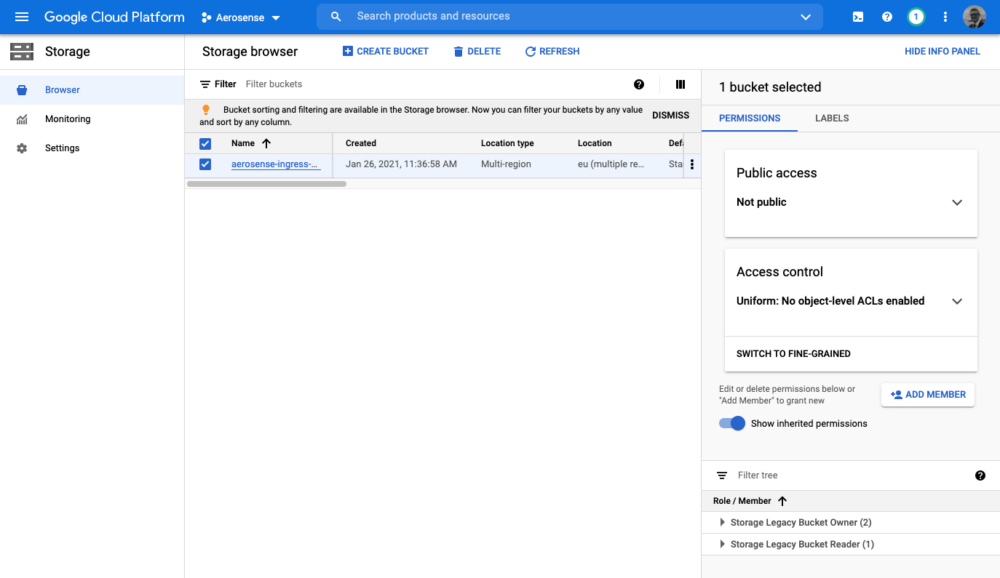

.. _deployment:

==========
Deployment
==========

To deploy the AeroSense system, you must:

- Register the deployment
- Create a deployment Service Account
- Configure and run the gateway (at the on-nacelle processor)

.. _register_the_deployment:

Register the deployment
=======================

A "deployment" is the act of commissioning the AeroSense system on a group of turbines (typically the turbines in a
particular wind farm).

For experimental and test purposes, there will typically be only one turbine (and therefore one gateway) per deployment.

TODO Registration process documentation - See Tom and Yuriy

.. _create_a_service_account:

Create a Service Account
========================

The gateway that you install on a turbine needs to upload data to AeroSense Cloud. However, we don't want "just anybody"
to be able to write data to the store - that leaves us vulnerable to a wide range of attacks. So the gateway must
authenticate itself with the store prior to upload.

To enable the gateway to authenticate itself, we use a **service account**, which is a bit like a user account (it has
an email address and can be given certain permissions) but for a non-human.

Here, we will create a service account for a deployment - this will result in a single credentials file that we can
reuse across the gateways (turbines) in the deployment to save administrative overhead maintaining all the credentials.

Log in to the ``aerosense-twined`` project on Google Cloud Platform (GCP) and work through the following steps:

**1. Go to IAM > Service Accounts > Create**

    Go to the service accounts view, and click "Create Service Account"

**2. Create the service account**

    The service account name should contain your deployment id (from above) in the pattern
    ``as-deployment-<deploymentId>``. In this case, ``deploymentId = gatewaytest``

**3. Skip assignation of optional roles and users (for now)**

    Do not assign roles or users for now. We'll assign the permissions for the specific resource(s) in step 6.

**4. Create and download a private JSON key for this Service Account**

    Find your newly created service account in the list (you may have to search) and click 'Create Key'.

    Choose the default JSON key type.

    Google will create a key file and it will be downloaded to your desktop.

**5. Locate the ingress bucket in the storage browser, and click on "Add Member"**

    From the left hand navigation menu, change to the Storage Browser view and locate the ``aerosense-ingress-eu``
    bucket. Select it, and click "Add Member" in the right hand control pane.

**6. Assign ``Storage Object Creator`` permission**

    We wish to add the service account created above to this bucket's permissions member list. Use the email address
    that was generated in step 2 to find your new service account and add it. We want the service
    account to have *minimal permissions* which in this case means assigning the role of ``Storage Object Creator``.

And you're done! Keep that downloaded permission file for later.

.. ATTENTION::

   Do not add to a docker image, email, skype/meet/zoom, dropbox, whatsapp, commit to git, post in an issue, or
   whatever, this private credentials file.

   Doing so will earn you the penance of flushing and rotating all the system credentials.

.. _configure_and_run_the_gateway:

Configure and run the Gateway
=============================

TODO